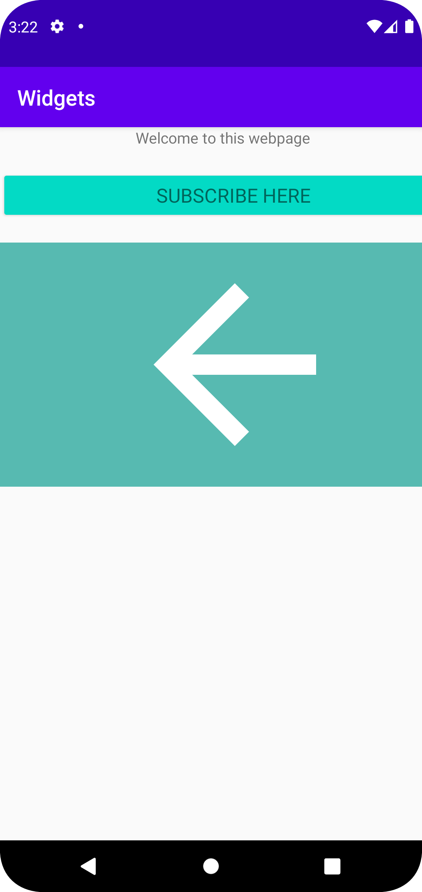

Inlämning 3

Jag har infört widgets samt linear layout där jag fått positionera samt stylea dem. 
Hänvisar till kod nedanför. 

Position har skett genom layout marginal top som avgör vart knappen ska positioneras. 
Android text är texten i knappen..

```
<Button
        android:id="@+id/button"
        style="@style/Widget.AppCompat.Button.Colored"
        android:layout_width="434dp"
        android:layout_height="wrap_content"
        android:text="SUBSCRIBE HERE"
        android:textAppearance="@style/TextAppearance.AppCompat.Medium"
        android:layout_marginTop="20dp"/>
```


 

